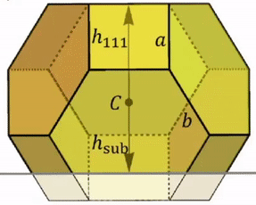

# Virtual-Angle-Calculator

The program helps to easily find the angle within any given image. 

 

Click any 3 points to find the angle between them. The first point is considered as the origin.
Double click mouse right button to remove the previous point.
Input 'r' to remove all the points or 'q' to quit the program.

## Requirements

Use the package manager [pip](https://pip.pypa.io/en/stable/) to install the following.

```bash
pip install opencv-python
pip install argparse
```

## Usage

```python
python virtualAngleCalculator.py --path image_path
